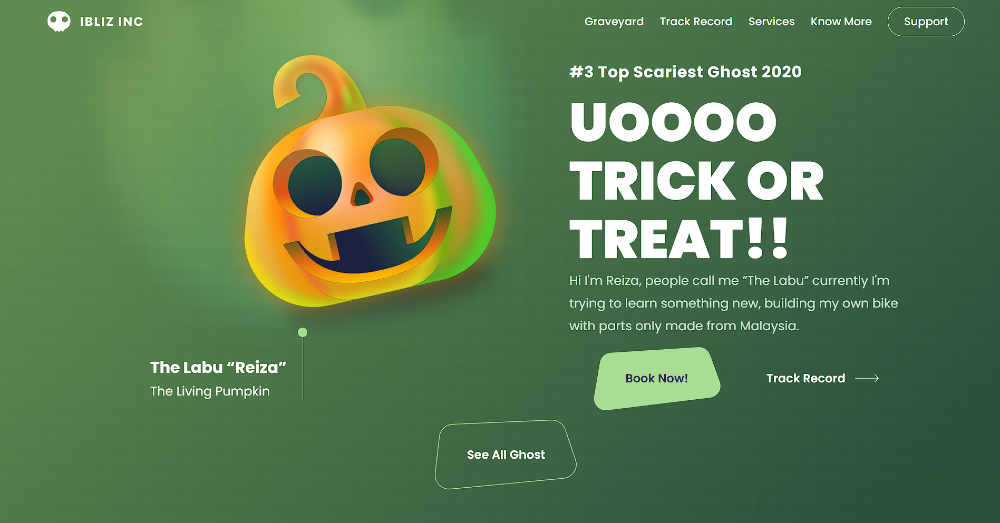

# Landing Page Halloween

## Descrição
A Landing Page Halloween é um projeto de página de destino temática para a celebração do Halloween. Ele apresenta uma interface assustadora e é ideal para promover eventos, festas ou produtos relacionados ao Halloween.

## Funcionalidades Principais
- Design temático de Halloween com elementos assustadores.
- Responsividade para dispositivos móveis

## Tecnologias Utilizadas
- HTML5
- CSS3
- JavaScript
- Git

## Pré-requisitos
- Navegador web moderno (Google Chrome, Mozilla Firefox, Safari, etc.)

## Como Utilizar
1. Faça o download ou clone o repositório (`git clone https://github.com/AngeloHervis/landing-page-halloween.git`).
2. Abra o arquivo `index.html` em seu navegador web para visualizar a página de destino.

## Autor
Angelo Hervis
- GitHub: [AngeloHervis](https://github.com/AngeloHervis)
- LinkedIn: [Angelo Hervis](https://www.linkedin.com/in/angelo-hervis/)